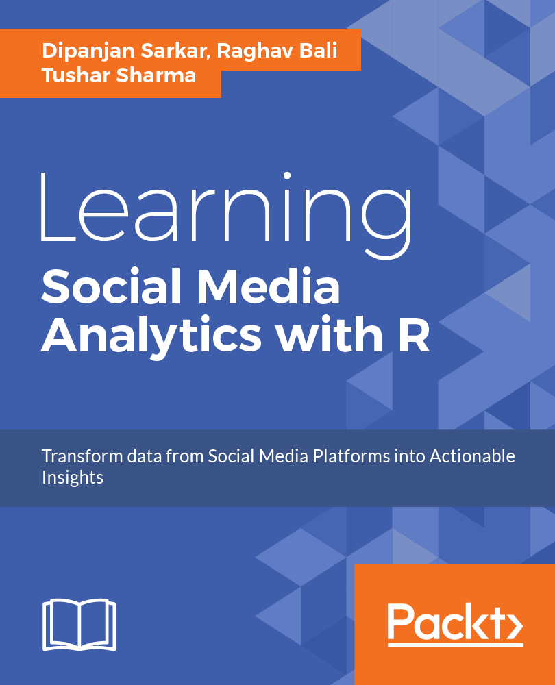

## Social Media Analysis with R

Diving into the world of social media and learning the science and art behind leveraging the power of R and analytics to transform data into actionable insights. This book will provide you with detailed strategies, workflows and hands-on approaches to tap into data from diverse social media platforms and showcase the power of leveraging analytics to get insightful information.

### The Book Source
<table style="width:100%" >
  <tr>
    <td></td>
  </tr>
</table>

### About the book

The Internet has truly become humongous, especially with the rise of various forms of social media in the last decade, which give users a platform to express themselves and also communicate and collaborate with each other. This book helps the reader to understand the current social media landscape and to learn how analytics can be leveraged to derive insights from it. This data can be analysed to gain valuable insights into the behavior and engagement of users, organizations, businesses, & brands. It helps readers frame business problems and solve them using social data.

The book covers several practical real-world use cases on social media using R and its advanced packages to utilise data science methodologies such as **sentiment analysis, topic modeling, text summarization, recommendation systems, social network analysis, classification, and clustering.** This enables readers to learn different hands-on approaches to obtain data from diverse social media sources such as Facebook & Twitter, showing readers how to establish detailed workflows to process, visualize, and analyse data to transform social data into actionable insights.

Edition: 1st &emsp; Pages: 394 &emsp; Language: English 
Book Title: Learning Social Media Analytics with R &emsp; Publisher: Packt 
Copyright: Sarkar, Bali & Sharma &emsp; ISBN 13: 9781787127524 

 

Key Features:
 - A practical guide written to help leverage the power of the R eco-system to extract, process, analyze, visualize and model social media data
 - Learn about data access, retrieval, cleaning, and curation methods for data originating from various social platforms.
 - Visualize and analyse data from social platforms to understand and model complex relationships using various concepts and techniques such as Sentiment Analysis, Topic Modeling, Text Summarization, Recommendation Systems, Social Network Analysis, Classification, & Clustering.

 

Key Take-aways:
 - Learn how to tap into data from diverse social platforms using the R ecosystem
 - Use social media data to formulate and solve real-world problems
 - Analyse user social networks and communities using concepts from graph theory and network analysis
 - Learn to detect opinion and sentiment, extract themes, topics, and trends from unstructured noisy text data from diverse social media channels
 - Understanding the art of representing actionable insights with effective visualizations
 - Analyse data from major social media channels such as Facebook, Twitter, Flickr, Foursquare, Github, StackExchange, ect
 - Learn to leverage popular R packages such as `ggplot2`, `topicmodels`, `caret`, `e1071`, `tm`, `wordcloud`, `twittR`, `Rfacebook`, `dplyr`, `reshape2`, and many more
